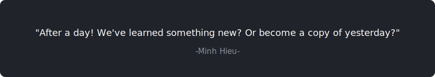

<svg xmlns="http://www.w3.org/2000/svg" viewBox="0 0 850 450" width="100%" height="100%">
  <defs>
    <linearGradient id="bgGrad" x1="0%" y1="0%" x2="100%" y2="100%">
      <stop offset="0%" stop-color="#0d1117" />
      <stop offset="100%" stop-color="#161b22" />
    </linearGradient>

    <linearGradient id="coreGrad" x1="0%" y1="0%" x2="100%" y2="0%">
      <stop offset="0%" stop-color="#58a6ff" />
      <stop offset="100%" stop-color="#79c0ff" />
    </linearGradient>
    <linearGradient id="frontGrad" x1="0%" y1="0%" x2="100%" y2="0%">
      <stop offset="0%" stop-color="#3fb950" />
      <stop offset="100%" stop-color="#56d364" />
    </linearGradient>
    <linearGradient id="backGrad" x1="0%" y1="0%" x2="100%" y2="0%">
      <stop offset="0%" stop-color="#bc8cff" />
      <stop offset="100%" stop-color="#d2a8ff" />
    </linearGradient>

    <filter id="glow" x="-20%" y="-20%" width="140%" height="140%">
      <feDropShadow dx="0" dy="0" stdDeviation="5" flood-color="#58a6ff" flood-opacity="0.5"/>
    </filter>

    <pattern id="dots" x="0" y="0" width="20" height="20" patternUnits="userSpaceOnUse">
      <circle fill="#ffffff" cx="2" cy="2" r="1" opacity="0.05"></circle>
    </pattern>
  </defs>

  <rect width="850" height="450" fill="url(#bgGrad)" rx="12" />
  <rect width="850" height="450" fill="url(#dots)" rx="12" />
  <rect width="850" height="450" fill="none" stroke="#30363d" stroke-width="2" rx="12" />

  <text x="425" y="45" fill="#c9d1d9" font-family="system-ui, -apple-system, sans-serif" font-size="18" font-weight="700" text-anchor="middle" letter-spacing="1">NGUYEN MINH HIEU</text>
  <text x="425" y="65" fill="#8b949e" font-family="system-ui, -apple-system, sans-serif" font-size="13" font-weight="400" text-anchor="middle" letter-spacing="2">SENIOR FRONTEND ARCHITECT</text>
  <line x1="300" y1="85" x2="550" y2="85" stroke="#30363d" stroke-width="1" />

  <g fill="none" stroke-width="2" opacity="0.6" stroke-dasharray="6,4">
    <path d="M 320 220 C 250 220, 250 140, 200 140" stroke="url(#frontGrad)" />
    <path d="M 320 220 C 220 220, 220 220, 200 220" stroke="url(#frontGrad)" />
    <path d="M 320 220 C 250 220, 250 300, 200 300" stroke="url(#frontGrad)" />

    <path d="M 530 220 C 600 220, 600 140, 650 140" stroke="url(#backGrad)" />
    <path d="M 530 220 C 630 220, 630 220, 650 220" stroke="url(#backGrad)" />
    <path d="M 530 220 C 600 220, 600 300, 650 300" stroke="url(#backGrad)" />
  </g>

  <g transform="translate(345, 180)">
    <rect x="0" y="0" width="160" height="80" rx="10" fill="#21262d" stroke="url(#coreGrad)" stroke-width="2" filter="url(#glow)"/>
    <text x="80" y="35" fill="#ffffff" font-family="system-ui, sans-serif" font-size="16" font-weight="bold" text-anchor="middle">ARCHITECTURE</text>
    <rect x="35" y="45" width="90" height="20" rx="10" fill="#1f6feb" opacity="0.2"/>
    <text x="80" y="59" fill="#79c0ff" font-family="system-ui, sans-serif" font-size="11" font-weight="bold" text-anchor="middle">SYSTEM CORE</text>
  </g>

  <g transform="translate(40, 115)">
    <rect width="160" height="50" rx="6" fill="#161b22" stroke="#3fb950" stroke-width="1.5"/>
    <text x="80" y="24" fill="#c9d1d9" font-family="system-ui, sans-serif" font-size="14" font-weight="600" text-anchor="middle">React &amp; Next.js</text>
    <text x="80" y="40" fill="#8b949e" font-family="system-ui, sans-serif" font-size="11" text-anchor="middle">SSR / SSG / App Router</text>
  </g>

  <g transform="translate(40, 195)">
    <rect width="160" height="50" rx="6" fill="#161b22" stroke="#3fb950" stroke-width="1.5"/>
    <text x="80" y="24" fill="#c9d1d9" font-family="system-ui, sans-serif" font-size="14" font-weight="600" text-anchor="middle">TypeScript</text>
    <text x="80" y="40" fill="#8b949e" font-family="system-ui, sans-serif" font-size="11" text-anchor="middle">Strict Typing / Generics</text>
  </g>

  <g transform="translate(40, 275)">
    <rect width="160" height="50" rx="6" fill="#161b22" stroke="#3fb950" stroke-width="1.5"/>
    <text x="80" y="24" fill="#c9d1d9" font-family="system-ui, sans-serif" font-size="14" font-weight="600" text-anchor="middle">Web Performance</text>
    <text x="80" y="40" fill="#8b949e" font-family="system-ui, sans-serif" font-size="11" text-anchor="middle">Core Web Vitals / LCP</text>
  </g>

  <g transform="translate(650, 115)">
    <rect width="160" height="50" rx="6" fill="#161b22" stroke="#bc8cff" stroke-width="1.5"/>
    <text x="80" y="24" fill="#c9d1d9" font-family="system-ui, sans-serif" font-size="14" font-weight="600" text-anchor="middle">Tailwind CSS v4</text>
    <text x="80" y="40" fill="#8b949e" font-family="system-ui, sans-serif" font-size="11" text-anchor="middle">Modern UI / UX</text>
  </g>

  <g transform="translate(650, 195)">
    <rect width="160" height="50" rx="6" fill="#161b22" stroke="#bc8cff" stroke-width="1.5"/>
    <text x="80" y="24" fill="#c9d1d9" font-family="system-ui, sans-serif" font-size="14" font-weight="600" text-anchor="middle">Systems &amp; CLI</text>
    <text x="80" y="40" fill="#8b949e" font-family="system-ui, sans-serif" font-size="11" text-anchor="middle">Rust / Node.js / npm</text>
  </g>

  <g transform="translate(650, 275)">
    <rect width="160" height="50" rx="6" fill="#161b22" stroke="#bc8cff" stroke-width="1.5"/>
    <text x="80" y="24" fill="#c9d1d9" font-family="system-ui, sans-serif" font-size="14" font-weight="600" text-anchor="middle">AI Integration</text>
    <text x="80" y="40" fill="#8b949e" font-family="system-ui, sans-serif" font-size="11" text-anchor="middle">Cursor / Claude / Zed</text>
  </g>

  <circle cx="200" cy="140" r="4" fill="#56d364" />
  <circle cx="200" cy="220" r="4" fill="#56d364" />
  <circle cx="200" cy="300" r="4" fill="#56d364" />

  <circle cx="650" cy="140" r="4" fill="#d2a8ff" />
  <circle cx="650" cy="220" r="4" fill="#d2a8ff" />
  <circle cx="650" cy="300" r="4" fill="#d2a8ff" />

  <circle cx="345" cy="220" r="5" fill="#58a6ff" />
  <circle cx="505" cy="220" r="5" fill="#58a6ff" />

  <text x="425" y="420" fill="#484f58" font-family="system-ui, sans-serif" font-size="10" font-weight="500" text-anchor="middle">DESIGNED FOR HIGH PERFORMANCE &amp; SCALABILITY</text>
</svg>

### 🛠 Tech Stack & Tools

**Architecture & High-Performance Frontend**

  
  
  
  

**Systems Programming & Backend**

  
  

**AI Integration & Advanced DevTools**

  
  
  

### 📦 Open Source & Tools Built
- **`next-query-sync`**: Advanced query synchronization library published on npm.
- **`safe-rm-hehe`**: A robust, systems-level command-line utility built in Rust and published on crates.io.

---

### 🔥 GitHub Stats

  

  

---

  

